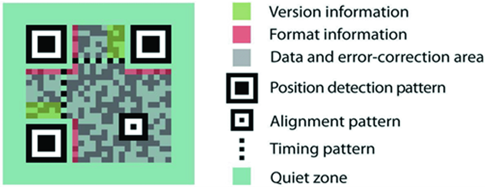

# MarginQR
## Getting started
Apple CoreImage suppports generating a QR image by using [CIQRCodeGenerator](https://developer.apple.com/library/archive/documentation/GraphicsImaging/Reference/CoreImageFilterReference/index.html#//apple_ref/doc/filter/ci/CIQRCodeGenerator).

This functionality is missing a "quiet zone" parameter which can help to increase the readable. 



MarginQR added this missing parameter for you!

## Demo
Before using, let's see how MarginQR can help!


## Installations
### Swift Package Manager
The [Swift Package Manager](https://swift.org/package-manager/) is a tool for automating the distribution of Swift code and is integrated into the swift compiler.

Once you have your Swift package set up, adding MarginQR as a dependency is as easy as adding it to the dependencies value of your Package.swift.
```
dependencies: [
    .package(url: "https://github.com/developerntuc/MarginQR", .upToNextMajor(from: "1.0.0"))
]
```
### Carthage
[Carthage](https://github.com/Carthage/Carthage) is a decentralized dependency manager that builds your dependencies and provides you with binary frameworks. To integrate Alamofire into your Xcode project using Carthage, specify it in your `Cartfile`:
```
github "developerntuc/MarginQR" ~> 1.0
```

## How to use
Just instanciate a `MarginQR` object
```swift
let qr = MarginQR(message: "Hello world!", 
          correctionLevel: .m, 
                quietZone: 4, 
                    scale: 5)

// Update to image view
myImageView.image = qr.uiImage
```

## License
MarginQR is released under the MIT license. [See LICENSE](https://github.com/developerntuc/MarginQR/blob/main/LICENSE) for details.